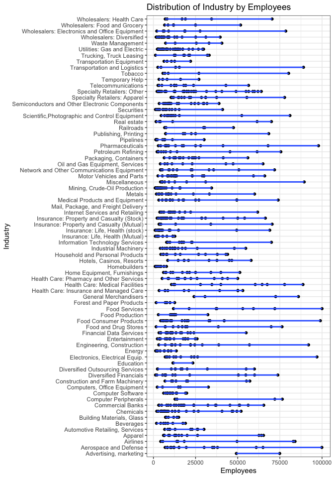

# Introduction


As compiled by the American business journal Fortune, the Fortune 1000 are the 1,000 biggest American companies measured by revenues. It only includes companies that are incorporated or approved to do business in the United States, and for which profits are publicly accessible.

In particular, we wonder how much technology companies with fewer employees, not large companies, find themselves in this list and/or whether there is a trend where these successful companies are established. We think that different and interesting results can be obtained with the number of employees and the sector category of the company. The dataset contains 1000 observations and 8 variables. Rank, Company, Sector, Industry, Location, Revenue, Profits, Employees parameters are used in this dataset as variables.

# Information of the Dataset

The [dataset](https://www.kaggle.com/agailloty/fortune1000) includes the top 1000 companies in the United States. Each row corresponds to a company with their information. 

The Fortune 1000 dataset contains 8 variables:

1. Rank: Company’s rank.
1. Company: Company name.
1. Sector: Which sector the company is in. There are 21 different sectors.
1. Industry: Which industry the company is in. There are 73 different industries.
1. Location: City, State.
1. Revenue: Company’s annual revenue.
1. Profits: Company’s annual profit.
1. Employees: Number of employees.

## Loading the dataset and the summary

```r
data <- read.csv("fortune1000.csv", header = TRUE)
```

## Loading necessary libraries

```r
library(dplyr) 
library(ggplot2)
library(rmarkdown)
library('ggplot2')
library(wordcloud2)
```

## Basic information about the data


```r
summary(data)
```

```
##       Rank          Company             Sector            Industry        
##  Min.   :   1.0   Length:1000        Length:1000        Length:1000       
##  1st Qu.: 250.8   Class :character   Class :character   Class :character  
##  Median : 500.5   Mode  :character   Mode  :character   Mode  :character  
##  Mean   : 500.5                                                           
##  3rd Qu.: 750.2                                                           
##  Max.   :1000.0                                                           
##    Location            Revenue          Profits            Employees      
##  Length:1000        Min.   :  1895   Min.   :-23119.00   Min.   :     52  
##  Class :character   1st Qu.:  2898   1st Qu.:    82.75   1st Qu.:   6405  
##  Mode  :character   Median :  5113   Median :   282.50   Median :  12520  
##                     Mean   : 13536   Mean   :   894.09   Mean   :  33028  
##                     3rd Qu.: 11386   3rd Qu.:   784.50   3rd Qu.:  28125  
##                     Max.   :482130   Max.   : 53394.00   Max.   :2300000
```

```r
head(data)
```

<div data-pagedtable="false">
  <script data-pagedtable-source type="application/json">
{"columns":[{"label":[""],"name":["_rn_"],"type":[""],"align":["left"]},{"label":["Rank"],"name":[1],"type":["int"],"align":["right"]},{"label":["Company"],"name":[2],"type":["chr"],"align":["left"]},{"label":["Sector"],"name":[3],"type":["chr"],"align":["left"]},{"label":["Industry"],"name":[4],"type":["chr"],"align":["left"]},{"label":["Location"],"name":[5],"type":["chr"],"align":["left"]},{"label":["Revenue"],"name":[6],"type":["int"],"align":["right"]},{"label":["Profits"],"name":[7],"type":["int"],"align":["right"]},{"label":["Employees"],"name":[8],"type":["int"],"align":["right"]}],"data":[{"1":"1","2":"Walmart","3":"Retailing","4":"General Merchandisers","5":"Bentonville, AR","6":"482130","7":"14694","8":"2300000","_rn_":"1"},{"1":"2","2":"Exxon Mobil","3":"Energy","4":"Petroleum Refining","5":"Irving, TX","6":"246204","7":"16150","8":"75600","_rn_":"2"},{"1":"3","2":"Apple","3":"Technology","4":"Computers, Office Equipment","5":"Cupertino, CA","6":"233715","7":"53394","8":"110000","_rn_":"3"},{"1":"4","2":"Berkshire Hathaway","3":"Financials","4":"Insurance: Property and Casualty (Stock)","5":"Omaha, NE","6":"210821","7":"24083","8":"331000","_rn_":"4"},{"1":"5","2":"McKesson","3":"Health Care","4":"Wholesalers: Health Care","5":"San Francisco, CA","6":"181241","7":"1476","8":"70400","_rn_":"5"},{"1":"6","2":"UnitedHealth Group","3":"Health Care","4":"Health Care: Insurance and Managed Care","5":"Minnetonka, MN","6":"157107","7":"5813","8":"200000","_rn_":"6"}],"options":{"columns":{"min":{},"max":[10]},"rows":{"min":[10],"max":[10]},"pages":{}}}
  </script>
</div>

```r
dim(data)
```

```
## [1] 1000    8
```

```r
str(data)
```

```
## 'data.frame':	1000 obs. of  8 variables:
##  $ Rank     : int  1 2 3 4 5 6 7 8 9 10 ...
##  $ Company  : chr  "Walmart" "Exxon Mobil" "Apple" "Berkshire Hathaway" ...
##  $ Sector   : chr  "Retailing" "Energy" "Technology" "Financials" ...
##  $ Industry : chr  "General Merchandisers" "Petroleum Refining" "Computers, Office Equipment" "Insurance: Property and Casualty (Stock)" ...
##  $ Location : chr  "Bentonville, AR" "Irving, TX" "Cupertino, CA" "Omaha, NE" ...
##  $ Revenue  : int  482130 246204 233715 210821 181241 157107 153290 152356 149558 146801 ...
##  $ Profits  : int  14694 16150 53394 24083 1476 5813 5237 9687 7373 13345 ...
##  $ Employees: int  2300000 75600 110000 331000 70400 200000 199000 215000 199000 281450 ...
```

## Check for missing values

```r
sum(is.na(data))
```

```
## [1] 0
```

## Restructure Data

```r
data$Sector <- as.factor(data$Sector)
data$Industry <- as.factor(data$Industry)
data$Company <- as.factor(data$Company)
data$Location <- as.factor(data$Location)

str(data)
```

```
## 'data.frame':	1000 obs. of  8 variables:
##  $ Rank     : int  1 2 3 4 5 6 7 8 9 10 ...
##  $ Company  : Factor w/ 996 levels "3M","99 Cents Only Stores",..: 945 331 83 126 566 904 257 373 355 98 ...
##  $ Sector   : Factor w/ 21 levels "Aerospace & Defense",..: 17 5 18 7 10 10 8 16 16 19 ...
##  $ Industry : Factor w/ 73 levels "Advertising, marketing",..: 27 51 12 40 73 28 22 47 47 62 ...
##  $ Location : Factor w/ 416 levels "Abbott Park, IL",..: 24 175 93 280 328 245 412 105 98 94 ...
##  $ Revenue  : int  482130 246204 233715 210821 181241 157107 153290 152356 149558 146801 ...
##  $ Profits  : int  14694 16150 53394 24083 1476 5813 5237 9687 7373 13345 ...
##  $ Employees: int  2300000 75600 110000 331000 70400 200000 199000 215000 199000 281450 ...
```

# One-Variable Plots

## Distribution of Employees

```r
qplot(
  x = Employees,
  data = data,
  xlab = "Employees",
  ylab = "",
  main = ("Distribution of Employee Count"),
  geom = "histogram",
  binwidth = 10000,
  fill = I("lightblue"),
  col = I("darkblue")
) +
  scale_x_continuous(limits = c(1000, 100000),
                     breaks = seq(1000, 100000, 10000))
```

<!-- -->

>In this plot, the x-axis represents the number of employees. The intervals are increasing by 10000s each. As seen in the graph, the number of employees is mostly distributed at 11000 points. This means that there are few companies with a high number of employees.

## Distribution of Sectors


```r
ggplot(data.frame(data$Sector), aes(x = data$Sector)) +
  geom_bar(color = "darkblue", fill = "lightblue") +
  ggtitle("Distribution of Sector") +
  theme(axis.text.x = element_text(angle = 90, hjust = 1))
```

<!-- -->

> You can see the distribution of sectors in this graph. The sector of greatest interest is financials, followed by the energy and technology sectors. Sectors of the least interest are apparel, food and drug stores and telecommunications. There are 50 companies belonging to the Business Services sector. When looking at the chart, the average distribution indicates that there are approximately 0-50 companies for each sector.

## Distribution of Revenues


```r
qplot(
  x = Revenue,
  data = data,
  xlab = "Revenue (million)",
  ylab = "Number of companies",
  main = ("Distribution of Revenue"),
  geom = "histogram",
  binwidth = 1000,
  fill = I("lightblue"),
  col = I("darkblue")
) +
  scale_x_continuous(limits = c(1000, 100000),
                     breaks = seq(1000, 100000, 10000))
```

<!-- -->

> In this plot, we look for the distribution of revenue by the number of companies. The intervals are increasing by 10000s each. It’s a right-skewed distribution. We can see that most of the companies’ revenues are between 1 and 11 billion. There are few companies with higher revenue than 21 billion.

## Distribution of Locations


```r
Z <- sort(table(data$Location), decreasing = TRUE)

wordcloud2(Z, size=0.39, color='random-dark')
```

<!--html_preserve--><div id="htmlwidget-be78ecef471f9e9c22fe" style="width:672px;height:480px;" class="wordcloud2 html-widget"></div>
<script type="application/json" data-for="htmlwidget-be78ecef471f9e9c22fe">{"x":{"word":["New York, NY","Houston, TX","Atlanta, GA","Chicago, IL","Dallas, TX","St. Louis, MO","Cleveland, OH","San Francisco, CA","Columbus, OH","Omaha, NE","Pittsburgh, PA","San Jose, CA","Charlotte, NC","Milwaukee, WI","Richmond, VA","Stamford, CT","Boston, MA","Cincinnati, OH","Denver, CO","Irving, TX","Las Vegas, NV","Los Angeles, CA","McLean, VA","Minneapolis, MN","Phoenix, AZ","Englewood, CO","Irvine, CA","Memphis, TN","San Antonio, TX","Tulsa, OK","Deerfield, IL","Lake Forest, IL","Portland, OR","Seattle, WA","St. Paul, MN","Sunnyvale, CA","Waltham, MA","Bellevue, WA","Indianapolis, IN","Louisville, KY","Mountain View, CA","Oklahoma City, OK","Philadelphia, PA","Plano, TX","Santa Clara, CA","Washington, DC","Arlington, VA","Bethesda, MD","Birmingham, AL","Brentwood, TN","Detroit, MI","Jacksonville, FL","Kansas City, MO","Miami, FL","Norwalk, CT","Parsippany, NJ","Providence, RI","San Diego, CA","Tempe, AZ","The Woodlands, TX","Allentown, PA","Baltimore, MD","Boca Raton, FL","Downers Grove, IL","Duluth, GA","Evansville, IN","Falls Church, VA","Glenview, IL","Knoxville, TN","Madison, WI","Nashville, TN","Oak Brook, IL","Overland Park, KS","Palo Alto, CA","Radnor, PA","Redwood City, CA","Reston, VA","Scottsdale, AZ","St. Petersburg, FL","Tampa, FL","Winston-Salem, NC","Akron, OH","Auburn Hills, MI","Berwyn, PA","Bloomington, IL","Boise, ID","Broomfield, CO","Burlington, MA","Cambridge, MA","Carmel, IN","Chesterfield, MO","Columbus, GA","Commerce, CA","Danbury, CT","Dublin, OH","Eden Prairie, MN","El Dorado, AR","Findlay, OH","Fort Lauderdale, FL","Fort Worth, TX","Foster City, CA","Framingham, MA","Franklin, TN","Fremont, CA","Glendale, CA","Grand Rapids, MI","Greenwich, CT","Greenwood Village, CO","Hartford, CT","Hoffman Estates, IL","Honolulu, HI","Horsham, PA","King of Prussia, PA","Lake Success, NY","Lexington, KY","Lincolnshire, IL","Little Rock, AR","Madison, NJ","Marlborough, MA","Maumee, OH","Melville, NY","Menlo Park, CA","Milpitas, CA","Neenah, WI","New Haven, CT","Newark, NJ","North Canton, OH","Northbrook, IL","Orlando, FL","Pasadena, CA","Princeton, NJ","Purchase, NY","Richardson, TX","Santa Monica, CA","Southfield, MI","Springfield, MA","Thousand Oaks, CA","Toledo, OH","Troy, MI","West Palm Beach, FL","Wilmington, DE","Woodland Hills, CA","Wyomissing, PA","York, PA","Abbott Park, IL","Angleton, TX","Ankeny, IA","Ann Arbor, MI","Annapolis Junction, MD","Arden Hills, MN","Armonk, NY","Austin, MN","Austin, TX","Avon Lake, OH","Bannockburn, IL","Baton Rouge, LA","Battle Creek, MI","Beaverton, OR","Beloit, WI","Benton Harbor, MI","Bentonville, AR","Bethpage, NY","Beverly Hills, CA","Bismarck, ND","Black Mountain, NC","Bloomfield Hills, MI","Bloomfield, CT","Bloomington, MN","Blue Bell, PA","Bolingbrook, IL","Branchville, NJ","Bristol, VA","Brookfield, WI","Buffalo, NY","Burbank, CA","Burlington, NC","Burlington, NJ","Byron Center, MI","Calabasas Hills, CA","Calabasas, CA","Calhoun, GA","Camden, NJ","Camp Hill, PA","Canonsburg, PA","Carthage, MO","Catawba, SC","Cayce, SC","Cedar Rapids, IA","Centennial, CO","Chandler, AZ","Chantilly, VA","Chattanooga, TN","Chesapeake, VA","Chesterbrook, PA","Clayton, MO","Clearfield, UT","Clearwater, FL","Columbia, MD","Columbus, IN","Coppell, TX","Coral Gables, FL","Coraopolis, PA","Corning, NY","Corona, CA","Corte Madera, CA","Costa Mesa, CA","Covington, LA","Crystal Lake, IL","Cudahy, WI","Cupertino, CA","Darien, CT","Dayton, OH","Dearborn, MI","Delaware, OH","Denton, TX","Des Moines, IA","Des Peres, MO","Dublin, CA","Dulles, VA","Durham, NC","El Paso, TX","El Segundo, CA","Elkhart, IN","Elma, NY","Elmsford, NY","Erie, PA","Estero, FL","Ewing, NJ","Fairfield, CT","Fairfield, OH","Fairlawn, OH","Farmington, CT","Federal Way, WA","Flint, MI","Florham Park, NJ","Fort Collins, CO","Fort Mill, SC","Fort Myers, FL","Fort Smith, AR","Fort Wayne, IN","Franklin Lakes, NJ","Galveston, TX","Glen Allen, VA","Goodlettsville, TN","Grapevine, TX","Greensboro, NC","Greenville, SC","Hanover, MD","Hartsville, SC","Hato Rey, PR","Hercules, CA","Herndon, VA","Hershey, PA","Hickory, NC","Highland Heights, KY","Hopkinton, MA","Hunt Valley, MD","Indianaoplis, IN","Inver Grove Heights, MN","Issaquah, WA","Itasca, IL","Jackson, MI","Jersey City, NJ","Johnston, RI","Juno Beach, FL","Kalamazoo, MI","Kenilworth, NJ","Kennett Square, PA","Kenosha, WI","Kingsport, TN","Kingwood, TX","Lafayette, IN","Lake Oswego, OR","Lakeland, FL","Lancaster, PA","Lansing, MI","Laurel, MS","Lebanon, TN","Lincoln, RI","Lisle, IL","Livonia, MI","Long Beach, CA","Long Island City, NY","Los Gatos, CA","Lowell, AR","Mahwah, NJ","Malvern, PA","Manhattan Beach, CA","Manitowoc, WI","Marysville, OH","Mayfield Village, OH","McKinney, TX","Mechanicsburg, PA","Mechanicsville, VA","Medford, OR","Medina, MN","Medina, OH","Melbourne, FL","Menomonee Falls, WI","Merriam, KS","Merrillville, IN","Merrimack, NH","Midland, MI","Milford, MA","Minnetonka, MN","Miramar, FL","Moline, IL","Monroe, LA","Mooresville, NC","Morris Plains, NJ","Morrisville, NC","Murray Hill, NJ","Muscatine, IA","New Albany, OH","New Braunfels, TX","New Britain, CT","New Brunswick, NJ","New Orleans, LA","Newport Beach, CA","Newport News, VA","Newton, MA","Norfolk, VA","North Chicago, IL","North Kansas City, MO","Norwell, MA","Norwood, MA","Novi, MI","Oakland, CA","Orrville, OH","Oshkosh, WI","Palm Beach Gardens, FL","Pawtucket, RI","Peoria, IL","Perrysburg, OH","Plymouth, MN","Port Washington, NY","Portsmouth, NH","Provo, UT","Raleigh, NC","Reading, PA","Red Bank, NJ","Redmond, WA","Reno, NV","Richfield, MN","Riverwoods, IL","Roanoke, VA","Rochester Hills, MI","Rochester, NY","Rockford, MI","Ronkonkoma, NY","Roseland, NJ","Rosemead, CA","Rosemont, IL","Rye Brook, NY","Salt Lake City, UT","San Juan, PR","San Leandro, CA","San Mateo, CA","San Rafael, CA","San Ramon, CA","Santa Ana, CA","Santa Rosa, CA","Sarasota, FL","Schaumburg, IL","Shelton, CT","Sidney, NE","Silver Spring, MD","South San Francisco, CA","Southlake, TX","Sparks, MD","Springdale, AR","Springfield, MO","St. George, UT","Stevens Point, WI","Summit, NJ","Sunbury, PA","Sunrise, FL","Sussex, WI","Sylmar, CA","Symmes Township, OH","Tacoma, WA","Tarrytown, NY","Taylor, MI","Teaneck, NJ","Thomasville, GA","Thomasville, NC","Topeka, KS","Tucson, AZ","Union, NJ","Van Buren Township, MI","Victor, NY","Voorhees, NJ","Wall, NJ","Wallingford, CT","Warren, PA","Warsaw, IN","Waterbury, VT","Waterford, NY","Watsonville, CA","Wauwatosa, WI","Wayne, NJ","Wellington, FL","West Chester, OH","Westbury, NY","Westchester, IL","Westlake, OH","Westport, CT","White Plains, NY","Wichita, KS","Williamsville, NY","Wilmerding, PA","Winona, MN","Woburn, MA","Woonsocket, RI","Worcester, MA","Zeeland, MI"],"freq":[72,44,23,22,16,14,11,11,10,10,10,10,9,9,9,9,8,8,8,8,8,8,8,8,8,7,7,7,7,7,6,6,6,6,6,6,6,5,5,5,5,5,5,5,5,5,4,4,4,4,4,4,4,4,4,4,4,4,4,4,3,3,3,3,3,3,3,3,3,3,3,3,3,3,3,3,3,3,3,3,3,2,2,2,2,2,2,2,2,2,2,2,2,2,2,2,2,2,2,2,2,2,2,2,2,2,2,2,2,2,2,2,2,2,2,2,2,2,2,2,2,2,2,2,2,2,2,2,2,2,2,2,2,2,2,2,2,2,2,2,2,2,2,2,1,1,1,1,1,1,1,1,1,1,1,1,1,1,1,1,1,1,1,1,1,1,1,1,1,1,1,1,1,1,1,1,1,1,1,1,1,1,1,1,1,1,1,1,1,1,1,1,1,1,1,1,1,1,1,1,1,1,1,1,1,1,1,1,1,1,1,1,1,1,1,1,1,1,1,1,1,1,1,1,1,1,1,1,1,1,1,1,1,1,1,1,1,1,1,1,1,1,1,1,1,1,1,1,1,1,1,1,1,1,1,1,1,1,1,1,1,1,1,1,1,1,1,1,1,1,1,1,1,1,1,1,1,1,1,1,1,1,1,1,1,1,1,1,1,1,1,1,1,1,1,1,1,1,1,1,1,1,1,1,1,1,1,1,1,1,1,1,1,1,1,1,1,1,1,1,1,1,1,1,1,1,1,1,1,1,1,1,1,1,1,1,1,1,1,1,1,1,1,1,1,1,1,1,1,1,1,1,1,1,1,1,1,1,1,1,1,1,1,1,1,1,1,1,1,1,1,1,1,1,1,1,1,1,1,1,1,1,1,1,1,1,1,1,1,1,1,1,1,1,1,1,1,1,1,1,1,1,1,1,1,1,1,1,1,1,1,1,1,1,1,1],"fontFamily":"Segoe UI","fontWeight":"bold","color":"random-dark","minSize":0,"weightFactor":0.975,"backgroundColor":"white","gridSize":0,"minRotation":-0.785398163397448,"maxRotation":0.785398163397448,"shuffle":true,"rotateRatio":0.4,"shape":"circle","ellipticity":0.65,"figBase64":null,"hover":null},"evals":[],"jsHooks":{"render":[{"code":"function(el,x){\n                        console.log(123);\n                        if(!iii){\n                          window.location.reload();\n                          iii = False;\n\n                        }\n  }","data":null}]}}</script><!--/html_preserve-->

>  Most of the companies in Forbes 1000 are in New York. Houston, Chicago and Atlanta follow New York. 

# Two-Variable Plots

## Distribution of Industry by Employees


```r
ggplot(data = data) +
  aes(x = Employees) +
  aes(y = Industry) +
  geom_point() +
  geom_smooth(method = "lm", se = T) +
  scale_x_continuous(limits = c(1000, 100000)) +
  scale_color_manual(values = c("black", "yellow")) +
  labs(col = "") +
  labs(title = "Distribution of Industry by Employees") +
  theme_bw()
```

<!-- -->

> In this plot, we want to observe the employee numbers of each company by industry type. As we expected, we can see that the number of employees in the service sector is generally high. We can say that the number of employees in most industries is low.

## Distribution of Revenue by Sector


```r
qplot(
  x = Sector,
  y = Revenue,
  data = data,
  main = ('Distribution of Revenue by Sector'),
  geom = 'boxplot',
  color = 'purple'
) +
  theme(axis.text.x = element_text(angle = 90, hjust = 1)) +
  scale_y_continuous(limits = c(1000, 50000),
                     breaks = seq(1000, 50000, 10000))
```

<!-- -->

> Box Plot shows a five-number summary of a data set. The five-number summary is the minimum, first quarter, median, third quarter, and maximum. From the box plot, we can see that most of the sectors have high variance revenues. Especially the sectors which have larger revenued companies and lesser revenued companies. This causes an increase in the variance and IQR. We can see that the highest median of the revenue is in the wholesalers sector. The maximum revenue is in the Food and Drug Stores sector. There is at least one outlier in every sector except the Food and Drug Stores sector. Business services’ IQR is low. This means companies' revenues are not diverse in this sector. Food and drug stores’ IQR is high. This means companies' revenues are diverse in this sector. Aerospace and Defence, Food/Beverages & Tobacco, Healthcare, and Wholesale sectors are all similar to each other. They all have large ranges and IQR values and similar medians.  


## Distribution of Revenue by Sector for Top 250 Companies


```r
first_quarter <-
  select(filter(data, Rank <= 250), c(Rank, Revenue, Sector))

qplot(
  x = Sector,
  y = Revenue,
  data = first_quarter,
  main = ('Distribution of Revenue by Sector for First 250 Companies'),
  geom = 'boxplot',
  color = 'purple'
) +
  theme(axis.text.x = element_text(angle = 90, hjust = 1)) +
  scale_y_continuous(limits = c(1000, 50000),
                     breaks = seq(1000, 50000, 10000))
```

<!-- -->

> This is the distribution of revenue by sector for the first 250 companies. The Chemical sector is one of the most unique sectors in the plot. Have a great stack at the Q3 area and have an outlier at a top point. So we can understand that there are a lot of companies at the same revenue level which is equal to the Q3 value and the last value at the data is the outlier one. But another interesting point about the data is the median. Although there is a stack at the Q3 point the median is so close to the lower median. Engineering sector has a similar graph to it, there is also a stack at the Q3 area but differently from the Chemicals sector their median is also equal to the Q3. And that more than or equal to half of the companies are at the same level of revenues and they are leading the sector in terms of revenue. 

> Household products sector is the most consistent sector in the data. Have a very small IQR and Range value compared to the other sectors and have not got any outlier values. Financials, Aerospace, Food/Beverages, Healthcare, Industrials and Wholesale sectors are all similar to each other. They all have large range and IQR values. Their median values are at the lower part of the IQR(except aerospace) and their IQR boxes are at the lower part of the range(except transportation). These means there are some companies with high revenues but the bigger part of the companies from that sector making revenues from lower levels.

>There are six outliers at the graph and they are all higher than the IQR boxes. That means there are some extremely successful companies in terms of revenue, but there aren't any extraordinarily unsuccessful companies. Since there are two outliers in the technology sector we can understand that the technology sector is easier to make a difference as a company and get high revenues. Although it seems like the technology sector is a small sector compared to the others, the highest revenue for a single company is from the technology sector and it submits our thesis.


## Distribution of Sectors by Profits


```r
ggplot(data, aes(Sector,Profits)) +
  geom_bar(stat = "identity", color="darkblue", fill="lightblue") + 
  labs(y = "Profit", x = "Sector")+ 
  theme(axis.text.x = element_text(angle = 90, hjust = 1))+
  scale_y_continuous(limits = c(-100000,100000), breaks = seq(-100000,100000,10000), labels = scales::comma)
```

<!-- -->


> This plot shows us minimum and maximum profits of the companies based on their sector. The blue lines represent the concentration of the number of companies.

> From this plot, we can see that the highest variance was in the Energy sector although the data concentrates on the profitable side. If we look at the Financial sector we can see that the most of the companies’ profitability is below or near 0. We can say that the media sector is risky since  the concentration of the companies are polarized. 
